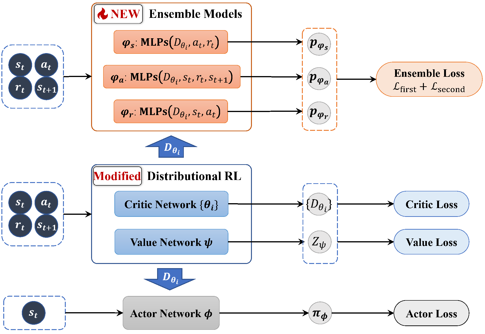

# Uncertainty-based Offline Variational Bayesian Reinforcement Learning for Robustness under Diverse Data Corruptions

This is an original PyTorch implementation of TRACER from

[Uncertainty-based Offline Variational Bayesian Reinforcement Learning for Robustness under Diverse Data Corruptions](https://openreview.net/forum?id=rTxCIWsfsD) by

Rui Yang, Jie Wang, Guoping Wu, and Bin Li

## Algorithm



TRACER is a offline Bayes reinforcement learning (RL) algorithm in continuous control. It focuses on developing training-time robust RL under the offline setting, where the offline training data is subject to various data corruptions, also known as corruption-robust offline RL.

TRACER demonstrates superiority in that:
- it can capture uncertainty caused by diverse corrupted data, including states, actions, rewards, and dynamics;
- it can distinguish corrupted data from clean data, thereby regulating the loss associated with corrupted samples to reduce the influence;
- it achieves significant performance gains across a range of both individual and simultaneous data corruptions.


We provide the main results in the following table under random and adversarial simultaneous corruptions.


*Table 1: Average scores and standard errors under random and adversarial simultaneous corruptions.*

| Env        | Corrupt | BC              | EDAC             | MSG              | UWMSG            | CQL              | IQL              | RIQL             | TRACER (ours)          |
|------------|---------|-----------------|-----------------|------------------|------------------|------------------|------------------|------------------|---------------------------|
|            | random  | 23.17 ± 0.43    | 1.70 ± 0.80     | 9.97 ± 3.44      | 8.31 ± 1.25      | 14.25 ± 1.39     | 24.82 ± 0.57     | 29.94 ± 1.00     | **33.04 ± 0.42**          |
| Halfcheetah| advers  | 16.37 ± 0.32    | 0.90 ± 0.30     | 3.60 ± 0.89      | 3.13 ± 0.85      | 5.61 ± 2.21      | 11.06 ± 0.45     | 17.85 ± 1.39     | **19.72 ± 2.80**          |
|            | random  | 13.77 ± 1.05    | -0.13 ± 0.01    | -0.15 ± 0.11     | 4.36 ± 1.95      | 0.63 ± 0.36      | 12.35 ± 2.03     | 17.42 ± 2.95     | **23.62 ± 2.33**          |
| Walker2d   | advers  | 6.75 ± 0.33     | -0.17 ± 0.01    | 3.77 ± 1.09      | 4.19 ± 2.82      | 4.23 ± 1.35      | 16.61 ± 2.73     | 9.20 ± 1.40      | **17.21 ± 1.62**          |
|            | random  | 18.49 ± 0.52    | 0.80 ± 0.01     | 15.84 ± 2.47     | 12.22 ± 2.11     | 3.16 ± 1.07      | 25.28 ± 15.34    | 22.50 ± 10.01    | **28.83 ± 7.06**          |
| Hopper     | advers  | 17.34 ± 1.00    | 0.80 ± 0.01     | 12.14 ± 0.71     | 10.43 ± 0.94     | 0.10 ± 0.34      | 19.56 ± 1.08     | 24.71 ± 6.20     | **24.80 ± 7.14**          |
| Average score |       | 15.98           | 0.65            | 7.53             | 7.11             | 4.66             | 18.28            | 20.27            | **24.54**                 |


## Instructions

Install dependencies:

```
conda env create -f conda_env.yml
conda activate tracer
```

Train the agent:

```
bash script/run_tracer.sh
```

If you want to use your own hyperparameters, set `default_setting=false`.

### Under Data Corruptions

Clean Data:
- set `use_corruption=false`.

Corrupted Data:
- set `use_corruption=true`;

    Corruption Mode:
    - Random Data Corruption: set `corruption_mode=random`;
    - Adversarial Data Corruption: set `corruption_mode=adversarial`.

    Corruption Type of Data:
    - Simultaneous Data Corruption: set `corruption_type=obs_act_rew_dynamics`;
    - Individual Data Corruption:
        - State Corruption: set `corruption_type=obs`;
        - Action Corruption: set `corruption_type=act`;
        - Reward Corruption: set `corruption_type=rew`;
        - Dynamics/Next State Corruption: set `corruption_type=dynamics`.


## Citation
If you find our work helpful for your research, please cite:
```
@inproceedings{yang2024uncertainty,
  title={Uncertainty-based Offline Variational Bayesian Reinforcement Learning for Robustness under Diverse Data Corruptions},
  author={Yang, Rui and Wang, Jie and Wu, Guoping and Li, Bin},
  booktitle={The Thirty-eighth Annual Conference on Neural Information Processing Systems},
  year={2024}
}
```
